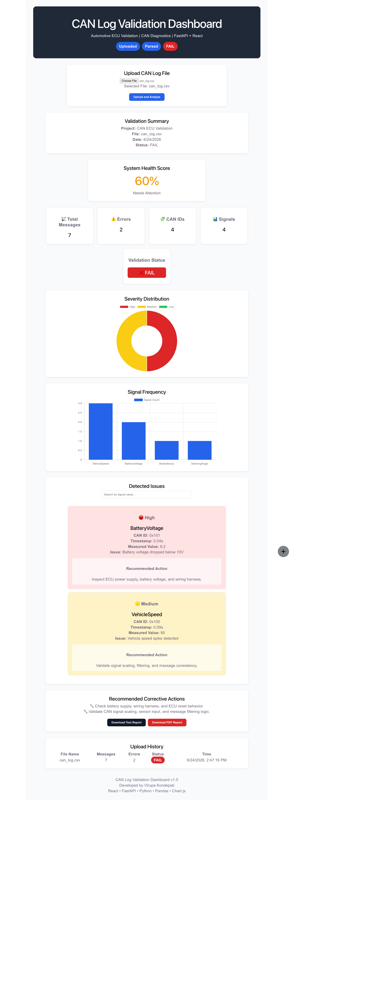

# 🚗 CAN Log Validation Dashboard

A full-stack web application for analyzing automotive CAN log files, detecting validation issues, visualizing results, and generating downloadable reports.



---

## Features

* Upload CAN log CSV files
* Automatic CAN log analysis
* Detect low battery voltage and signal anomalies
* PASS / FAIL validation status
* System health score calculation
* Severity distribution chart
* Signal frequency chart
* Validation recommendations
* Download PDF report
* Download text report
* Upload history

---

## Technology Stack

### Frontend

* React
* Vite
* Chart.js
* Axios

### Backend

* FastAPI
* Python
* Pandas
* Uvicorn

---

## Project Architecture

```text
                User
                  │
                  ▼
         React Frontend (Vite)
                  │
        Upload CAN Log CSV
                  │
                  ▼
          FastAPI REST API
                  │
          Pandas Data Analysis
                  │
          Validation Engine
                  │
   Issue Detection & Health Score
                  │
                  ▼
 Dashboard + Charts + PDF/Text Reports
```

A more detailed explanation is available in:

```text
docs/ARCHITECTURE.md
```

---

## Folder Structure

```text
can-log-analyzer
│
├── backend/
│   ├── main.py
│   ├── requirements.txt
│
├── frontend/
│   ├── src/
│   ├── public/
│
├── sample-data/
│   └── can_log.csv
│
├── screenshots/
│   └── full-dashboard.png
│
├── docs/
│   └── ARCHITECTURE.md
│
├── CONTRIBUTING.md
├── LICENSE
└── README.md
```

---

## Getting Started

### Backend

```bash
cd backend
pip install -r requirements.txt
uvicorn main:app --reload
```

Backend URL:

```text
http://127.0.0.1:8000
```

---

### Frontend

```bash
cd frontend
npm install
npm run dev
```

Frontend URL:

```text
http://localhost:5173
```

---

## Sample Validation Checks

Current validation rules include:

* Low battery voltage detection
* Vehicle speed spike detection
* Signal threshold validation
* Severity classification
* PASS / FAIL determination
* Health score calculation

---

## Reports

The application can generate:

* PDF validation report
* Text validation report

Each report includes:

* Validation summary
* Detected issues
* Severity level
* Recommended actions

---

## Future Enhancements

* DBC file decoding
* BLF and ASC log support
* Live CAN streaming
* CAN message timeout detection
* Rolling counter validation
* CRC validation
* Authentication
* Cloud deployment

---

## Skills Demonstrated

* Full-stack development
* REST API development
* Automotive CAN log analysis
* Data processing with Pandas
* React UI development
* Report generation
* Git & GitHub workflow
* Software validation concepts

---

## Author

**Virupa Kondepati**

GitHub: https://github.com/Virupa27

---

## License

This project is licensed under the MIT License.
