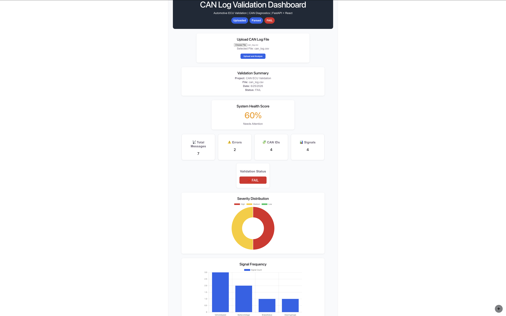
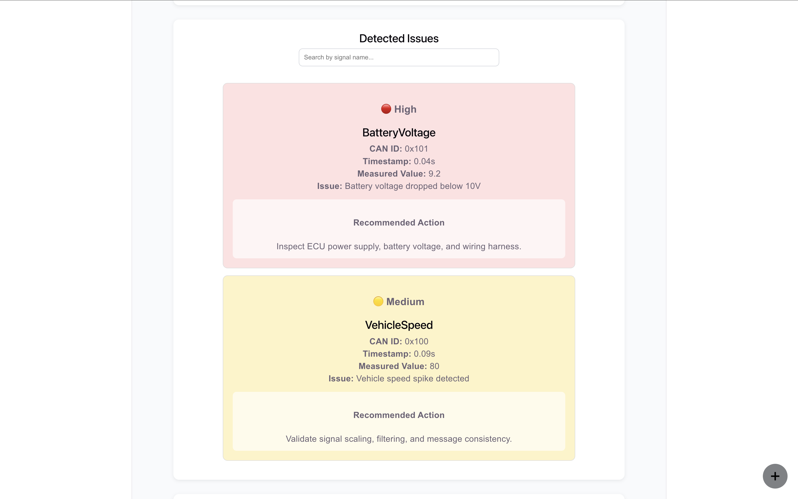
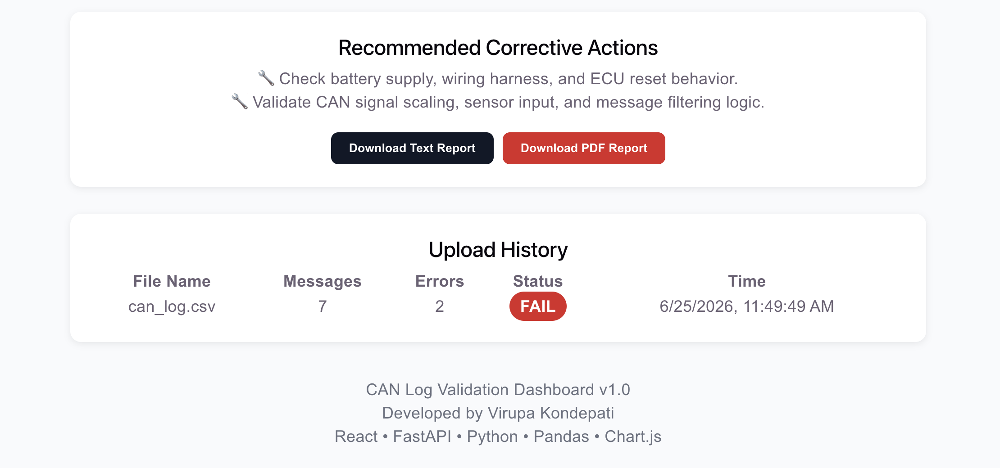

# 🚗 CAN Log Validation Dashboard | React + FastAPI + Automotive Diagnostics

A full-stack web application for analyzing automotive CAN log files, detecting validation issues, visualizing results, and generating downloadable reports.

## 🌐 Live Demo

**Frontend**

https://can-log-validation-dashboard-o2nc-ot5500ejt-virupa-projects.vercel.app

**Backend API**

https://can-log-validation-backend.onrender.com

## Source Code

GitHub Repository:
https://github.com/Virupa27/can-log-validation-dashboard

## Dashboard Overview



---

## Issue Detection



---

## Report Generation


---

## Features

- Upload automotive CAN log CSV files
- Automatic CAN log validation
- Detect low voltage and signal anomalies
- Calculate ECU health score
- PASS / FAIL validation status
- Interactive charts and analytics
- Severity-based issue classification
- Search detected issues
- Upload history tracking
- Download PDF and text reports
---

## 🚀 Project Highlights

- Full-stack React + FastAPI application
- Interactive dashboard with PASS/FAIL validation
- Real-time CAN log analysis
- PDF and text report generation
- System Health Score calculation
- Interactive charts using Chart.js
- Deployed on Vercel and Render


## Technology Stack

### Frontend

* React
* Vite
* Chart.js
* Axios

### Backend

* FastAPI
* Python
* Pandas
* Uvicorn

---

## Project Architecture

```text
                User
                  │
                  ▼
         React Frontend (Vite)
                  │
        Upload CAN Log CSV
                  │
                  ▼
          FastAPI REST API
                  │
          Pandas Data Analysis
                  │
          Validation Engine
                  │
   Issue Detection & Health Score
                  │
                  ▼
 Dashboard + Charts + PDF/Text Reports
```

A more detailed explanation is available in:

```text
docs/ARCHITECTURE.md
```

---

## Folder Structure

```text
can-log-analyzer
│
├── backend/
│   ├── main.py
│   ├── requirements.txt
│
├── frontend/
│   ├── src/
│   ├── public/
│
├── sample-data/
│   └── can_log.csv
│
├── screenshots/
│   └── full-dashboard.png
│
├── docs/
│   └── ARCHITECTURE.md
│
├── CONTRIBUTING.md
├── LICENSE
└── README.md
```

---

## Getting Started

## Deployment

Frontend:
- Vercel

Backend:
- Render

Version Control:
- GitHub

### Backend

```bash
cd backend
pip install -r requirements.txt
uvicorn main:app --reload
```

Backend URL:

```text
http://127.0.0.1:8000
```

---

### Frontend

```bash
cd frontend
npm install
npm run dev
```

Frontend URL:

```text
http://localhost:5173
```

---

## 🔌 API Endpoints

| Method | Endpoint | Description |
|--------|----------|-------------|
| GET | / | API Status |
| POST | /upload-log | Upload and analyze CAN log |
| GET | /download-report | Download text report |
| GET | /download-pdf-report | Download PDF report |


## Sample Validation Checks

Current validation rules include:

* Low battery voltage detection
* Vehicle speed spike detection
* Signal threshold validation
* Severity classification
* PASS / FAIL determination
* Health score calculation

---

## Reports

The application can generate:

* PDF validation report
* Text validation report

Each report includes:

* Validation summary
* Detected issues
* Severity level
* Recommended actions

---
## Future Enhancements

- DBC file decoding
- ASC and BLF log support
- Real-time CAN bus monitoring
- CAN message timeout detection
- Rolling counter validation
- CRC validation
- User authentication
- Cloud database integration
- Multi-file comparison
- AI-powered anomaly detection

---

## Skills Demonstrated

- Full-Stack Development
- React.js
- FastAPI
- REST API Development
- Python
- Pandas
- Automotive CAN Diagnostics
- Data Visualization
- Report Generation
- Cloud Deployment (Vercel & Render)
- Git & GitHub
---


## Current Status

- Production Ready
- Frontend deployed on Vercel
- Backend deployed on Render
- REST APIs implemented
- Interactive Dashboard
- PDF & Text Report Generation
- Documentation Completed


## Author

**Virupa Kondepati**

GitHub:
https://github.com/Virupa27

Project Repository:
https://github.com/Virupa27/can-log-validation-dashboard

---

## License

This project is licensed under the MIT License.
